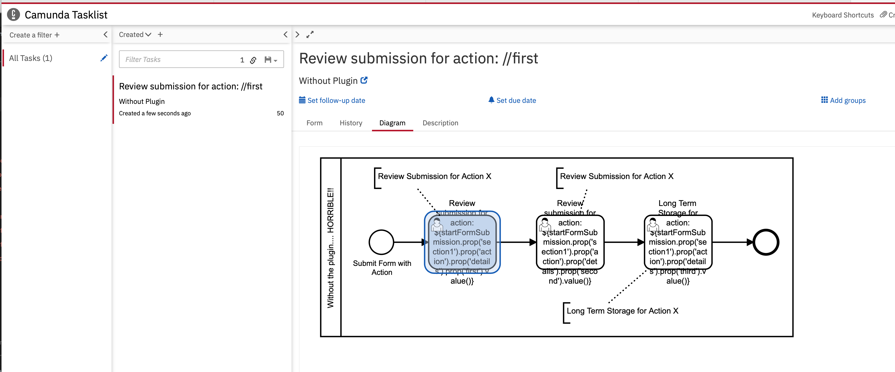
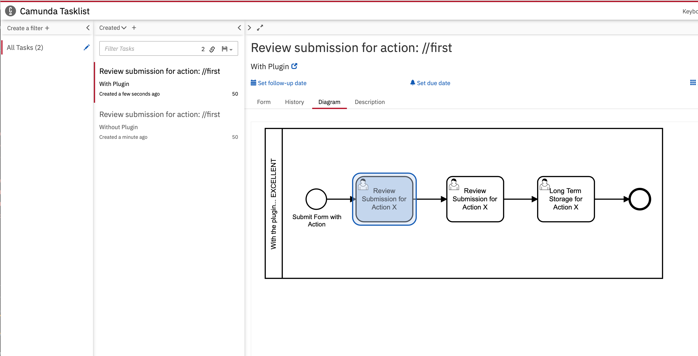
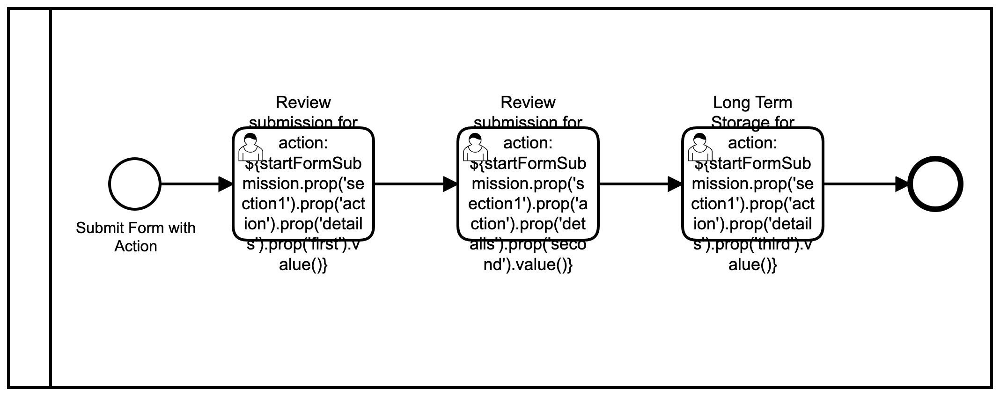
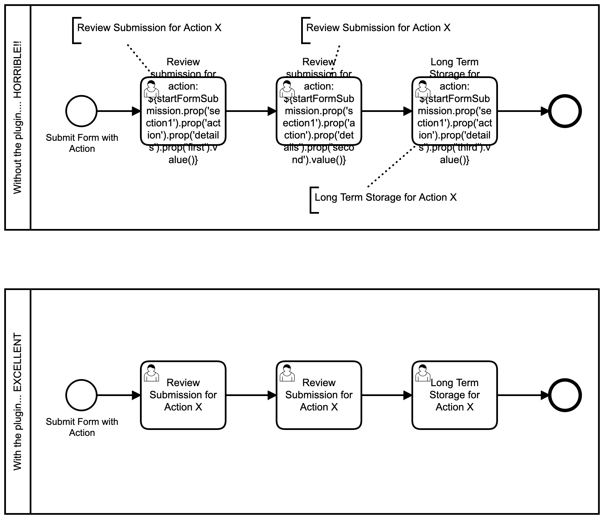
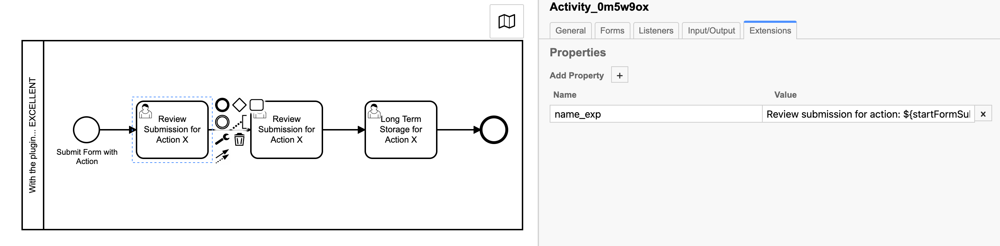

# Camunda User Task Name Expression Process Engine Plugin

A Camunda process engine plugin for using Camunda Extension Properties on a User Task to set the User Task's Name as an expression.

Task Lists Apps (such as Camunda Tasklist):

Without Plugin:
   


With Plugin:
   

Using an expression on a User Task is very common; User Tasks get rendered in task lists such as Camunda Tasklist, and 
the User Task's name is what is presented to the user completing the task / doing the work.  In order to provide an
efficient and clean work experience, modelers will add contextual information into the User Task `name` property to ensure 
the user using a task list has contextual information in the list of tasks 
(easier to find tasks and differentiate between similar tasks).  

Example: `Review Ticket` vs `Review HR Ticket` vs `Review Software Ticket`, where `Review Ticket` has no context.

When building modern workflows,the use of complex User Task names is commonly used with a mix of multiple variables 
including JSON variables.  User Task name expressions start to look like: 

```
Review submission for action: ${startFormSubmission.prop('section1').prop('action').prop('details').prop('first').value()}
```

Which would render to something like:

```
Review submission for action: Org Risk Review
```

Problems appear when visually rendering the BPMN... A BPMN has a dual purpose: 1. It is a visual presentation of a business process, 
and 2. it is a definition of the technical execution of the business process.  From the technical side having the expressions 
in the task `name` field is correct and does not cause any issues.  But when you render the BPMN as promoted by Camunda (a few examples [1](https://docs.camunda.org/manual/7.14/user-guide/process-engine/process-diagram-api/
), [2](https://docs.camunda.org/manual/7.14/webapps/cockpit/bpmn/process-definition-view/
), [3](https://docs.camunda.org/manual/7.14/webapps/cockpit/bpmn/process-instance-view/
)), the rendering becomes something like this:



This is a *horrible* user experience for anyone that needs to read the visual representation of the BPMN.

----

This problem has been raised with the Camunda devs as part of [CAM-12811](https://jira.camunda.com/browse/CAM-12811).


The goal was to get Camunda to add this style of functionality to the engine: Where you can define a User Task Name and optionally an additional Expression:
Where the Name is what is shown on the BPMN visual rendering, and the expression (optional) is what is rendered as the Task name in task lists, etc.


**Camunda's recommend solutions in CAM-12811 to this problem are:**

"...without clogging up the BPMN modeling experience..."

1. `"Add/use Annotations to describe your task"`: This added a huge amount of junk annotations to the BPMN.
1. `"Add "context" to a user task's form"`: but this requires you to open every form to know what is the context.
1. `"Create a parse listener to replace the name with a expression"`: Accept that every developer that implements camunda is now going to have to rebuild this code???

So that brings us to this process engine plugin...

**This plugin is a community solution to a ~basic~ problem that hopefully Camunda will bring into core in one form or another...**


**BPMN renderings should not have to be a trade off between these two examples:**





**We should be able to build models that are both technical and business friendly...**

(And for anyone that will say "Well, you are using a very complex expression in your example..." well other solutions 
mean you have to create additional process or local variables just so you can set a Task name, or you have to deal with additional 
tricks and workarounds to massage data into a format that can be as short as possible: And then repeat that for EVERY SINGLE USER TASK...)

---

## How it works

1. Create a user task and set the `name` property.  This will be the name that is used in the BPMN visual renderings.
1. In the user task go to the Extensions Tab and create a property as follows:
   
   **Name**: `name_exp`
   
   **Value**: `${my expression here}`.  such as 
   
   ```
   Review submission for action: ${startFormSubmission.prop('section1').prop('action').prop('details').prop('first').value()}
   ```
   
   

You add your expression in the exact same way you would add your expression in the `name` property.

There are two supported extension names/keys: `name_expression` and `name_exp`.  You can configure your own in the Plugin's configuration.

## Install

1. Build the Jar yourself or download the jar from this repo's releases. 
1. Add the jar to your `/camunda/lib` folder
1. Enable the plugin in your bpm-platform.xml file:
   ```xml
   ...
   <plugins>
      <plugin>
         <class>com.github.stephenott.camunda.plugin.UserTaskNameExpressionParseListenerProcessEnginePlugin</class>
         <properties>
            <property name="extensionKeys">name_expression,name_exp</property>
         </properties>
      </plugin>
   </plugins>
   ...
   ```
   You can omit the properties if you don't want to change the defaults.

1. Deploy your BPMN.  On deployment the plugin will hook into the parsing of the user task and set the proper configuration.

DONE!